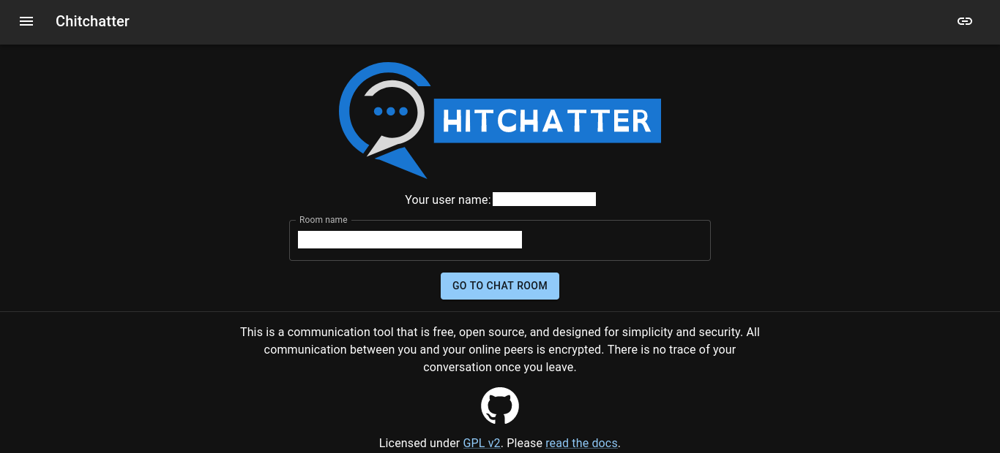

import Bleed from 'nextra-theme-docs/bleed'

# Chitchatter

**Chitchatter** is a communication tool that is free, open source, and designed for simplicity and security. All communication between you and your online peers is encrypted. There is no trace of your conversation once you leave.

It supports Markdown and React components ([MDX](/features/mdx)).

Preview Image:

<Bleed></Bleed>
